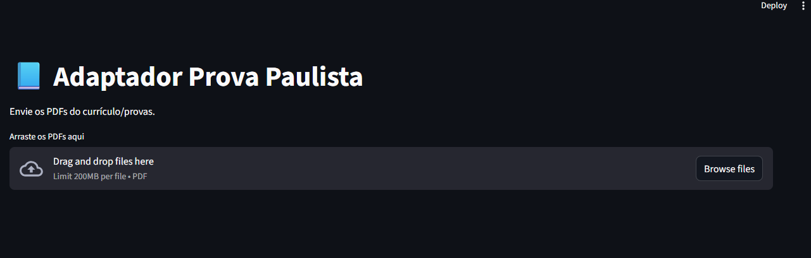

# Adaptador Prova Paulista
## 🖥️ Protótipo funcionando

Sistema em desenvolvimento para ajudar professores a adaptar
materiais da Prova Paulista e Currículo Paulista para alunos
com necessidades educacionais específicas.

## Problema real
Professores são avaliados pelo desempenho dos alunos nas provas
oficiais, mas as avaliações não vêm adaptadas para alunos com:
- TEA
- TDAH
- Dislexia
- DI

Isso gera:
- perda de nota
- evasão
- exclusão
- frustração docente

## Solução
Este protótipo:
- lê PDFs oficiais
- identifica disciplina e segmento
- organiza habilidades
- prepara base para adaptação automática

## Próximos passos
- detecção de série e bimestre
- cadastro de alunos
- geração de versão adaptada
- versão SaaS para escolas

Projeto em desenvolvimento por professora da rede pública.
